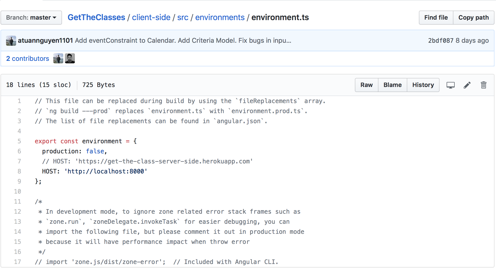

# GetTheClasses
The schedule website that help Georgia Tech students schedule their favorite classes with the most convenient time.

## To run the app:
- You only required to clone down client-side folder.
- From the client-side folder, edit this Path: __src/environments/environment.ts__
- Uncomment the __heroku__ server as a host and comment out __localhost__



## For developer:
### Server side:
Go to the server-side folder and type in the following line
```
npm run dev
```

### Client side:
Go to the client-side folder and type in the following line
```
ng serve
```
